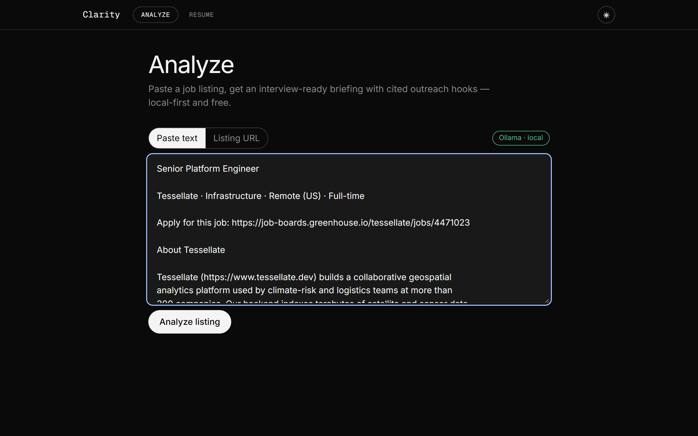
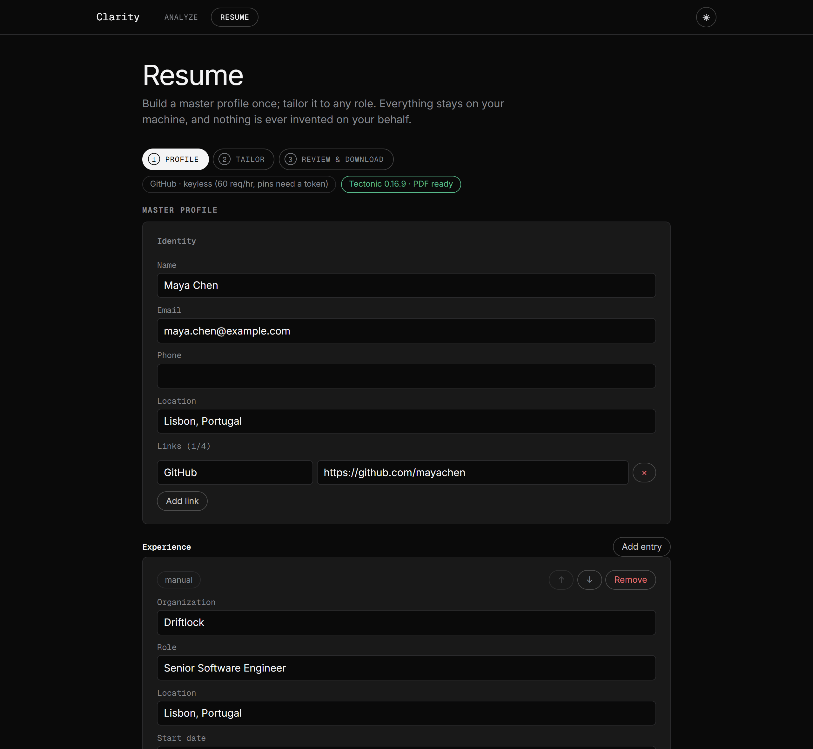

# Clarity

Paste a job listing, get an interview-ready briefing with cited outreach hooks —
**local-first and free**.


*A full keyless run on the bundled [`greenhouse-style.txt`](apps/web/fixtures/listings/greenhouse-style.txt) fixture with `qwen3:4b` — no API key. Every image in this README is generated from the app actually running; regenerate them with the scripts in [`docs/media/`](docs/media/).*

Clarity turns one job listing into the research you'd otherwise do by hand before
applying or reaching out:

- **A structured profile** of the role — company, seniority, named technologies,
  product area — extracted from the pasted text or a listing URL.
- **A briefing** on the company (what they do, product area, stack, team signals,
  recent launches, seniority fit), streamed token by token, with a confidence badge
  and source citations on every section.
- **2–3 outreach hooks** — specific, true things you could open a message with,
  each citing the page it came from. Hooks whose citations can't be verified
  against pages the run actually fetched are dropped, not shown.
- **An opt-in contact search** over public sources only (the listing itself, the
  careers page, a public GitHub org), returning candidates labeled `public` or
  `guess` — never a guess dressed up as a fact.
- **A draft outreach note**, streamed as it's written, that you copy or open in
  **your own** mail client. Clarity never sends mail.

The listing is the unit of input, never the company: every role has a listing, so
the tool works for a 20-person startup with no engineering blog just as well as for
a big company — it just honestly reports thinner coverage.

**And once you've researched a role, tailor a resume to it.** Clarity keeps a local
**master profile** — built from a pasted resume, your GitHub repos, and/or a LinkedIn
export — and turns it into a role-tailored `.tex` or PDF that **selects and reorders**
from what you have actually done, optionally rephrasing a bullet under strict grounding
gates, and **never inventing** a skill, number, or claim. See
[Tailoring a resume for a role](#tailoring-a-resume-for-a-role).

## Quickstart

You need **Node.js ≥ 22** (Node 24 LTS recommended) and either
[Ollama](https://ollama.com) (free, local, no key) or your own OpenAI/Anthropic API
key.

```bash
git clone https://github.com/essandhu/clarity.git
cd clarity/apps/web
npm install
cp .env.example .env.local        # Windows PowerShell: copy .env.example .env.local
# edit .env.local — pick ONE provider (see below); for the free path:
#   MODEL_PROVIDER=ollama
npm run dev
```

Open <http://localhost:3000>. The chip next to the input tells you which provider
the app actually resolved (`Ollama · local`, `OpenAI · your key`,
`Claude · your key`) — if it warns `Ollama · not reachable`, Ollama isn't running
or `OLLAMA_BASE_URL` points at the wrong place.



## Your first run — no API key required

This is the intended first experience, verified end to end on a machine with no
cloud key:

1. **Install Ollama** from <https://ollama.com> (tested with Ollama 0.31) and pull
   the default model:

   ```bash
   ollama pull qwen3:4b
   ```

2. In `apps/web/.env.local`, set:

   ```
   MODEL_PROVIDER=ollama
   ```

   (`OLLAMA_BASE_URL` defaults to `http://localhost:11434` and `OLLAMA_MODEL`
   defaults to `qwen3:4b` — you only set those to override.)

3. `npm run dev`, open <http://localhost:3000>, and confirm the chip reads
   **Ollama · local**.

4. **Paste a listing** (the *Paste text* tab) and click **Analyze listing**. Any
   listing works; if you want a ready-made one, paste the contents of
   `apps/web/fixtures/listings/sparse-startup.txt` — a deliberately sparse
   startup listing that shows how the tool degrades honestly when the listing is
   the only source. (Very long listings are analyzed up to the first 20,000
   characters.)

5. **Watch the run stream.** Each stage renders as live steps: extraction, then
   tiered company enrichment, then the briefing sections streaming one at a
   time with their confidence badge and citations mounted **before** the text
   arrives. With a listing that names a company site, the enrichment stage
   fetches homepage / careers / blog / GitHub pages as individual rows —
   skipped or dead pages show as honest skip chips, and cached pages are tagged
   *cached* on re-runs; with the sparse fixture (no company site named), the
   tiers instead land as honest not-found chips with zero fetches. On a paste-only run, sections grounded solely in the listing
   cite a non-link **“Pasted listing text”** chip; sections with no source at all
   say **“Not found in available sources.”** instead of inventing content. You
   can cancel at any point and keep what has already streamed.

6. **Optionally click “Find a contact for this role.”** Nothing contact-related
   runs before that click. You get up to a handful of candidates — a contact
   listed in the posting (`public`, citing where it appeared), a person found on
   public pages with the right channel to reach them, and/or an inferred email
   pattern that is always labeled **guessed — unverified**. The response also says
   which sources were tried (listing / careers page / GitHub) even when nothing
   was found.

7. **Click “Draft outreach note.”** The note streams in grounded on your
   hooks; then hit **Copy note** or **Open in mail**. A guessed email never
   enters the `mailto:` link unless you explicitly click **Use this guessed
   address** first — until then the mail button reads *Open in mail (no
   address)* rather than presenting a guess as fact.

**Set your expectations for local speed honestly.** `qwen3:4b` is a *thinking*
model, and on a CPU-only laptop its reasoning phases dominate: the sparse
paste-only walkthrough above has been measured completing its briefing and hooks
in about five minutes with the draft note taking another fifteen, but reasoning
scales with source material — on source-rich runs, single sections have been
observed thinking for tens of minutes and a full keyless run can stretch to
hours. A GPU-backed Ollama or a cloud key brings this down dramatically. Clarity
is built so that slow-but-healthy local generations are never killed by a timer,
and progressive rendering means you see extraction, coverage, and early sections
long before the run finishes.

## Model providers

One `ModelProvider` implementation runs all three backends through the Vercel AI
SDK; you choose with env vars in `apps/web/.env.local`:

| Provider | Set | Model used |
| --- | --- | --- |
| **Ollama** (free, local) | `MODEL_PROVIDER=ollama` | `OLLAMA_MODEL` (default `qwen3:4b`) |
| **OpenAI** (your key) | `OPENAI_API_KEY=sk-…` | `gpt-5-mini` |
| **Anthropic** (your key) | `ANTHROPIC_API_KEY=sk-ant-…` | `claude-sonnet-5` |

If `MODEL_PROVIDER` is unset, the app auto-detects from present keys (OpenAI
first, then Anthropic). Ollama is never auto-selected — it has no key, so you opt
in explicitly. Cloud model ids are deliberately constants, not knobs. Per-run
cloud cost is cents, on your own key; there is no shared service and no gate.

**The local-model tradeoff, honestly.** Extraction — turning a messy listing into
the structured profile — works acceptably on small local models: Clarity uses
Ollama's native JSON-schema-constrained decoding at temperature 0, with exactly
one repair re-prompt on a validation failure. Synthesis polish is where you feel
the difference: briefing prose and the draft note from a 4B model are serviceable
but noticeably below cloud quality, and CPU-only generation is slow. Known-good
tags:

- `qwen3:4b` — the default, and the model the end-to-end keyless walkthrough was
  verified with. It's a thinking model; Clarity keeps its reasoning phase off your
  screen while still treating it as liveness, so long thinks don't trip the stall
  watchdog.
- `llama3.2:3b` — smaller and faster, no thinking phase.
- `phi4-mini:3.8b` — similar class.

If a run fails with `EXTRACTION_FAILED` on an exotic model, that's the honest
failure mode: the model couldn't produce schema-valid output even after one
repair pass. Try one of the tags above.

## Configuration

Everything is optional except picking a provider. From `apps/web/.env.example`:

| Variable | Default | Meaning |
| --- | --- | --- |
| `MODEL_PROVIDER` | auto-detect | `openai` \| `anthropic` \| `ollama` |
| `OPENAI_API_KEY` / `ANTHROPIC_API_KEY` | — | your own key (BYO-key) |
| `OLLAMA_BASE_URL` | `http://localhost:11434` | where Ollama listens |
| `OLLAMA_MODEL` | `qwen3:4b` | any pulled tag |
| `CLARITY_MAX_FETCHES` | `12` (ceiling 20) | max page fetches per run |
| `CLARITY_DEADLINE_MS` | `60000` (ceiling 120000) | wall-clock ceiling on **fetching** |
| `CLARITY_MODEL_INACTIVITY_MS` | `300000` | model watchdog: any model call (an extraction, or a stream making no progress) is aborted after this long without progress |
| `GITHUB_TOKEN` | — | optional fine-grained PAT (public repos, read-only) for the GitHub profile importer; raises the keyless 60/hr ceiling to 5,000/hr and enables pinned-repo ordering |
| `TECTONIC_PATH` | auto-detect on `PATH` | absolute path to the Tectonic binary for PDF compile; without it the `.tex` download still works |

`GET /api/health` reports the resolved provider (and, for Ollama, reachability of
the configured base URL), plus whether Tectonic and a GitHub token are present — it's
what drives the chips, and it never exposes keys (the GitHub token is checked for
presence only, never dialed or echoed).

## Privacy: local-first is the point

Your job-search activity — which companies you target, who you consider
contacting, what you draft — **never leaves your machine**. That's a feature, not
just a cost decision:

- No hosted backend, no accounts, no database server. Clarity itself contains no
  analytics or tracking of any kind — the app is a local Next.js server you run
  yourself. (One framework caveat, stated because this README doesn't hide
  things: Next.js sends anonymous build/dev telemetry to Vercel unless you opt
  out — run `npx next telemetry disable` once if you want that off too.)
- The only outbound traffic is (a) calls to the model provider **you** configured
  — with Ollama that's your own machine (the default `http://localhost:11434`),
  so your listing text, briefing, and drafts never leave it — and (b) plain HTTP
  fetches of public company pages (homepage, careers, blog, GitHub org) during a
  run you started.
- Fetched pages are cached as flat JSON files under `apps/web/data/` (24-hour
  TTL), so a re-run skips refetching: the fetch phase of a warm re-run completes
  in seconds with zero network for cached pages (the model work still runs).
  That directory is gitignored — your research trail can't accidentally end up
  in a commit.
- Contact results are **never persisted** — not to disk, not to the cache. They
  exist only in the response to your click.
- Your **master profile** is the one thing Clarity does store, and it stays local: a
  single gitignored JSON file under `apps/web/data/`. Resume imports (pasted text, the
  GitHub API, a LinkedIn export ZIP) are processed **in memory** and land in the editor
  for review — nothing is saved until you click Save, and the raw LinkedIn archive is
  never written to disk. A GitHub PAT, if you set one, is sent only to GitHub in the
  request header — never stored in a response, cache file, or log.

## Being a good web citizen

A tool that fetches arbitrary company sites has to behave. Clarity's fetcher, by
construction:

- **Respects `robots.txt`** (RFC 9309), including `Crawl-delay`. Disallowed paths
  surface in the UI as honest "blocked by robots.txt" skips. If a robots file
  can't be fetched due to a server error, Clarity conservatively skips the page
  rather than assuming permission.
- **Rate-limits itself per host** — at most 2 concurrent requests and at least 1
  second between requests to the same host (more if robots asks for it) — with
  timeouts, capped retry backoff, and a per-origin circuit breaker so a struggling
  site is left alone.
- **Identifies itself honestly** with a descriptive User-Agent:
  `ClarityBot/0.1 (+https://github.com/essandhu/clarity; local job-research tool)`.
- **Is budgeted**: a run makes at most `CLARITY_MAX_FETCHES` page fetches (default
  12) inside a hard wall-clock window; the opt-in contact search is separately
  capped at 3 fetches / 30 seconds. Every URL Clarity discovers on its own
  (enrichment candidates, links mined from fetched pages, contact re-reads) is
  filtered to public web hosts before it is dialed — a fetched page can never
  steer which URLs Clarity chooses to fetch toward localhost or intranet
  addresses. Redirect landing pages are re-checked against the target's
  robots.txt and refused if they land on a sign-in wall, and the opt-in
  contact search additionally discards any content whose redirect landed on a
  non-public host.

And on the outreach side:

- **No mail is ever sent.** Clarity drafts; you send, individually, from your own
  client via `mailto:` or copy-paste.
- **No SMTP probing** to "verify" guessed emails — guesses stay labeled guesses.
- **No phone numbers.** Phone-shaped strings are stripped from contact results;
  they're needless for job outreach.
- **You are the data controller of your own outreach.** Clarity surfaces
  hiring-context contacts from public sources and retains nothing, but what you
  send, to whom, is yours — anti-spam law (CAN-SPAM) and GDPR/UK-GDPR apply to
  you as the sender, and the individually-written, personalized note this tool
  produces is both the legally sane path and the one that actually converts.

## Reading the output: coverage honesty

Clarity **reports its own coverage instead of papering over gaps**:


- Every enrichment tier lands as a chip: `found` / `not found` /
  `skipped — budget`. A dead careers page is a visible skip row, not silence, and
  never sinks the rest of the run.
- Every briefing section carries a computed confidence badge — **grounded** (a
  relevant fetched page backs it), **listing-only** (only the listing backs it),
  or **not found** — and a **not found** section gets canned "Not found in
  available sources." copy with **no model call at all**, so there is nothing to
  hallucinate.
- Confidence is computed by domain code from what was actually fetched — the
  model never gets to grade its own claims.
- Every claim links back to its source; pasted listings are cited as a non-link
  "Pasted listing text" chip. Hooks citing pages the run never fetched are
  dropped server-side.
- Contact candidates are labeled `public` (taken from the listing's stated
  contact or found verbatim in a cited public source) or `guess` (an inferred email pattern, dashed styling, requires
  an explicit accept click before it's usable). v1 never claims a verified email
  — that genuinely requires a paid database, so the tool doesn't pretend.

## Tailoring a resume for a role

Clarity's second half turns **your** saved career history into a resume tailored to a
specific role — and, like the briefing, it is built to never invent. You keep a **master
profile** (all your experience, projects, education, and skills) locally; for any role you
paste or hand off from an analyze run, Clarity **selects** the most relevant entries and
bullets, **reorders** them, optionally **rephrases** a bullet or two, and hands you a
LaTeX `.tex` or a compiled PDF.

Open the **Resume** tab in the top nav to build a profile; after any analyze run you can
also click **“Tailor resume for this role”** to carry that role straight over — no
re-typing.



### Nothing is invented — and reverts say so out loud

Every string in the output is either verbatim master content, a mechanically joined field
(headings, dates, locations), or a rephrase that passed five mechanical gates. There is no
free-written “summary” or “objective” the model could fill with fiction. The gates:

1. **Known ids only** — the model picks your entries and bullets by id; any id it did not
   get from your profile is dropped.
2. **No new numbers** — a rephrase cannot introduce a figure (`40%`, `10x`, `120ms`) that
   is not already in the source bullet.
3. **No new claims** — every meaningful word in a rephrased bullet must trace (by word
   stem) back to that bullet or its entry’s own org / role / technologies; the role’s own
   named technologies are additionally locked out, so a job ad demanding “Kubernetes”
   cannot smuggle “Kubernetes” into a bullet that never mentioned it.
4. **Skills stay yours** — a tailored skills list is a strict subset of your master skills
   and technologies, and its category labels must be ones you actually used.
5. **Revert, don’t drop** — a rephrase that fails any gate **reverts to your exact original
   bullet**, and the UI *names the blocked words*: “kept your wording — would have added:
   kubernetes, 10x”. You always see what the model tried and why it was refused.

The coverage panel also renders the honest keyword gap — “In the role, not in your profile:
Kubernetes, Terraform — not added” — as information, never as something the tool silently
pads the resume with. And if the local model’s selection call fails outright, the run does
not die: it falls back to a plain most-recent-first selection labeled **“Untailored”**, so
you get a usable (if unpolished) resume instead of an error.

After a run you can toggle any entry or bullet off — or add back one the model skipped —
with **zero model calls** (a pure client-side re-fold); the coverage counts update live,
and a “what changed” diff shows exactly which words a rephrase altered against your master.

### Building your master profile

Your profile lives at `apps/web/data/profile/master.json` — on your machine, gitignored,
never uploaded. Build it three ways (all optional, all combinable), then review and
**Save**. Imports never auto-save, so nothing touches your stored profile without a click.

- **Paste a resume.** Paste your existing resume as text; the local model extracts it into
  structured entries, and **every extracted string is checked back against your paste** — a
  bullet, employer, or date the model garbles or invents is dropped and reported, never
  shown as if it were real.
- **Import from GitHub.** Enter your username, tick repos, import. Each repo becomes a
  project entry with its description, topics, and languages copied **verbatim** plus a link
  to the repo — bullets are yours to write (Clarity never generates them, and never reads
  your README prose). Keyless works at **60 requests/hour**; ordering is by stars and
  pinned repos need a token. To raise the limit to **5,000/hour** and enable pinned-first
  ordering, add a **fine-grained personal access token** to `.env.local` as `GITHUB_TOKEN`
  — grant it **“Public repositories” (read-only) and nothing else**. The token is only ever
  sent to GitHub in the request header; it never appears in any response, cache file, or log.
- **Import from LinkedIn.** In LinkedIn: *Settings & Privacy → Data privacy → “Get a copy
  of your data.”* The **10-minute** fast tier covers most of a resume; **Volunteering and
  your profile summary need the full (~24 hour) archive.** Upload the ZIP — it is parsed
  **in memory**, and only the **9 résumé CSVs** are read. Messages, connections, and
  registration data are **never opened**, and PII columns (birth date, address, zip,
  geolocation, IM/Twitter handles) are dropped at the mapping boundary. Nothing from the
  archive is written to disk.

Saves are protected against corruption: each save first copies the last good file to
`master.json.bak`, and a `master.json` that cannot be parsed is treated as a first-class
**unreadable** state — the app names the `.bak` restore path and refuses to blindly
overwrite it (a fresh save moves the corrupt bytes aside to `master.json.corrupt-<timestamp>`
rather than over your backup).

### Downloading: `.tex` always, PDF when Tectonic is installed

The **`.tex` download always works** — the model never writes LaTeX. A fixed, vendored
Jake’s-Resume template is filled by domain code through a single escaping choke point, and
the server regenerates the `.tex` from exactly the entries you see (a request cannot smuggle
raw LaTeX in).

For a **PDF**, install **Tectonic** (a self-contained LaTeX engine) and either put it on
your `PATH` or point `TECTONIC_PATH` at it:

| OS | Install |
| --- | --- |
| Windows | `scoop install tectonic` |
| macOS | `brew install tectonic` |
| Linux | `pacman -S tectonic` or `conda install -c conda-forge tectonic` |
| Any | the release binary from [github.com/tectonic-typesetting/tectonic](https://github.com/tectonic-typesetting/tectonic/releases) |

(Deliberately **not** winget or Chocolatey — their Tectonic packages are absent or stale.)
The health chip on the Resume page tells you whether Clarity found the binary and its
version.

**The one honest network caveat:** the very first PDF compile downloads ~290 LaTeX support
files (~43 MB) from Tectonic’s package CDN. This is disclosed on the Resume page beside the
compile button whenever a compile would open the network, and **only public TeX packages
travel inbound — your resume content is never sent anywhere.**
After that first success every compile runs fully offline (`--only-cached`); if the package
cache is ever missing while offline, the compile fails with a typed error and an explicit
**“Re-download LaTeX packages (~43 MB)”** button — Clarity never silently re-opens the
network. The compiled PDF previews inline on the page.

## Architecture

Next.js App Router app in `apps/web/`, with domain logic strictly separated from
infrastructure (an ESLint layering rule makes `src/domain/**` importing
infrastructure — the AI SDK, jsdom/cheerio, cockatiel, bottleneck, Next.js,
node `fs`, or any provider implementation — a lint failure, not a code-review
hope):

```
apps/web
├── app/
│   ├── page.tsx                  # Analyze UI shell
│   ├── resume/page.tsx           # Resume UI shell (master profile + tailoring)
│   └── api/
│       ├── analyze/route.ts      # POST → stages 1–3 (extract → enrich → synthesize) as SSE
│       ├── contact/route.ts      # POST → opt-in Stage 4 (public-source contact)
│       ├── draft/route.ts        # POST → streamed draft note (SSE)
│       ├── health/route.ts       # GET  → resolved provider + Ollama/Tectonic/GitHub-token status
│       ├── profile/route.ts      # GET/PUT → load/save the master profile (plain JSON)
│       ├── profile/import/…       # POST → resume (SSE) / github / linkedin importers
│       ├── tailor/route.ts       # POST → tailoring pipeline as SSE (loads profile from store)
│       └── resume/render/route.ts# POST → .tex (always) / .pdf (via Tectonic)
├── src/
│   ├── domain/                   # framework-free business logic
│   │   ├── pipeline/             # orchestration, run budget, typed errors
│   │   ├── listing/              # Stage 1: extraction → ListingProfile
│   │   ├── enrichment/           # Stage 2: tiered, budgeted, parallel fetches
│   │   ├── synthesis/            # Stage 3: briefing + hooks + draft prompts
│   │   ├── contact/              # Stage 4: rank/dedupe/cap, email patterns
│   │   ├── profile/              # master-profile merge + resume-import grounding
│   │   └── resume/               # tailoring gates, fallback, LaTeX generation
│   ├── providers/                # pluggable infra behind interfaces
│   │   ├── model/                # ModelProvider: openai | anthropic | ollama
│   │   ├── fetch/                # robots-aware, rate-limited, resilient fetcher
│   │   ├── contact/              # PublicSourceContactSurfacer + GitHub signal
│   │   ├── cache/                # flat-JSON page cache (24h TTL)
│   │   ├── profile/              # JsonFileProfileStore (atomic writes + .bak)
│   │   ├── import/               # GitHub REST importer + LinkedIn ZIP reader
│   │   ├── latex/                # LatexCompiler: Tectonic behind an interface
│   │   └── search/               # SearchProvider interface only (future seam)
│   ├── shared/schema/            # zod schemas — the single source of truth,
│   │                             #   including the SSE wire protocol
│   ├── server/                   # composition root + SSE encoder
│   └── components/               # the streaming UI (reducer-driven)
└── data/                         # local page cache + master profile (gitignored)
```

A run streams over SSE as typed, zod-validated events (`step.started`,
`step.finished`, `synthesis.delta`, `budget.exhausted`, …) with heartbeats,
monotonic sequence numbers, and exactly one terminal event — the client is a pure
reducer over that stream, which is how live agent steps, progressive cards,
cancellation, and honest skip chips all fall out of one mechanism. Stage 4 and
the draft live on separate user-initiated routes, so "opt-in" is structural, not
a convention.

The tailoring and import routes reuse the same machinery — SSE where a run
streams (pasted-resume import, tailoring), plain JSON where it doesn't (profile
load/save, GitHub, LinkedIn, render) — so the reducer-driven client, heartbeats,
and typed-event discipline carry straight over to the resume half.

## Development

```bash
cd apps/web
npm run test    # vitest — the full unit/protocol suite
npm run lint    # eslint, including the domain-layering rule
npm run build   # next build
npm run dev     # dev server
```

`apps/web/scripts/` has standalone smoke scripts (`try-model.ts`, `try-fetch.ts`,
`try-extract.ts`, `try-cache.ts`, `try-walkthrough.ts` for the analyze chain, and
`try-import.ts` / `try-tailor.ts` for the resume chain) that drive individual
layers — or whole flows — against live services via `npx tsx`, useful when
validating a new model tag or debugging behavior. The full v1.1 resume chain
(paste-import → save → GitHub import → tailor → toggles/diff → render `.tex` →
compile PDF) runs end-to-end, with in-driver PASS/FAIL checks, against a running
prod build via:

```bash
npm run build && npm run start &          # serve the prod build
npx tsx scripts/try-tailor.ts --walkthrough --github <your-username>
```
