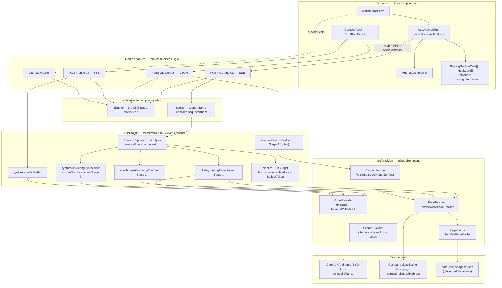
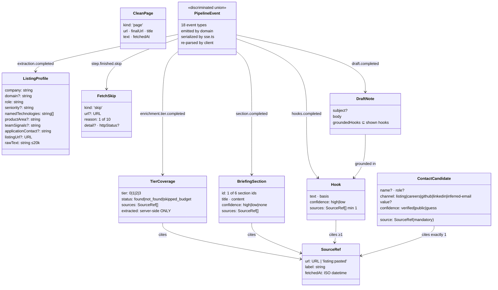
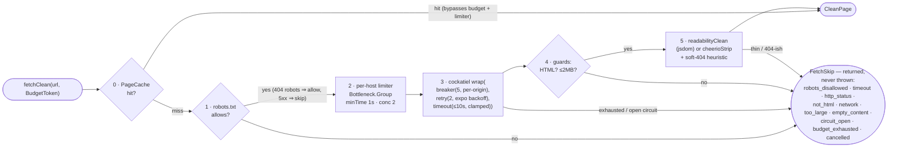
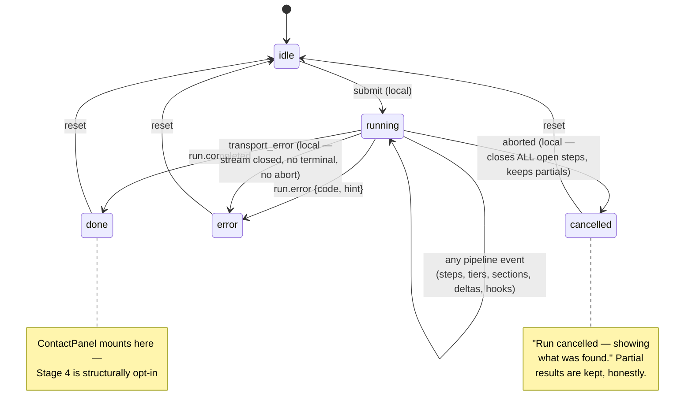
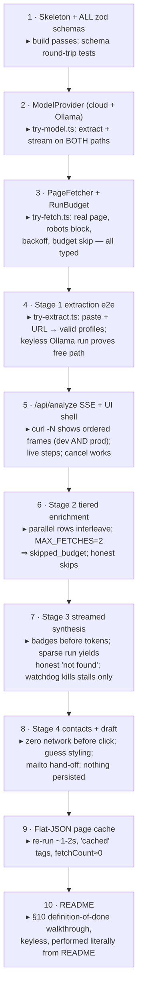

# Clarity — Architecture Diagrams

Visual companion to [PLAN.md](./PLAN.md) (the authoritative implementation plan) and
[clarity-v1-spec.md](../clarity-v1-spec.md) (the product spec). These diagrams are the
reference during implementation: when code and diagram disagree, one of them is wrong —
fix it deliberately, in both places.

---

## 1. System layers

The non-negotiable separation: business logic lives in `src/domain/**`, route handlers are
thin adapters, and every effectful dependency sits behind a provider interface. An ESLint
`no-restricted-imports` rule makes the domain layer *unable* to import `next`, `ai`, `jsdom`,
`cockatiel`, `cheerio`, `bottleneck`, or `node:fs`.



`src/shared/schema/` (zod, single source of truth) is imported by **every** layer — the same
`PipelineEventSchema` is emitted by the domain, serialized by `sse.ts`, and re-parsed by the
client reducer, so protocol drift is a failing test rather than a rendering bug.

---

## 2. Pipeline anatomy — one `/api/analyze` run

Stages are strictly sequential; fetches inside Stage 2 run in parallel. Only Stage 1 (and
provider misconfiguration) can kill a run — skips are data, not errors.

```mermaid
flowchart LR
    INPUT(["AnalyzeInput<br/>{kind:'url'} | {kind:'text'}"])

    subgraph STAGE1["Stage 1 — Extraction (always succeeds or run fails)"]
        FETCH1["URL path: one budgeted fetchClean<br/>(skip here IS fatal → INPUT_INVALID)"]
        EXTRACT["model.extract → ListingProfile<br/>(zod-validated, 1 repair re-prompt)"]
        DERIVE["domainDeriver:<br/>job-board denylist → email domain → model"]
    end

    subgraph STAGE2["Stage 2 — Enrichment (tiered · budgeted · never fatal)"]
        T0["Tier 0 — the listing itself<br/>zero cost, always found"]
        T1["Tier 1 — homepage /about /careers<br/>/jobs /product (≤5, one host)"]
        T2["Tier 2 — GitHub org · eng blog · changelog<br/>discovered from Tier-1 links"]
        T3["Tier 3 — news / launches"]
        COV["coverage.ts →<br/>found | not_found | skipped_budget"]
    end

    subgraph STAGE3["Stage 3 — Synthesis (streamed, serial sections)"]
        CONF["confidenceRules: coverage →<br/>high | low | none (deterministic, NOT model)"]
        SECT["6 sections: what-they-do · product-area ·<br/>stack · team-signals · seniority-fit · recent-launches<br/>none ⇒ canned 'Not found', NO model call"]
        HOOKS["HookSynthesizer: extract ≤3 hooks,<br/>drop any citing unfetched URLs"]
    end

    subgraph STAGE4["Stage 4 — opt-in, OUTSIDE runAnalysis"]
        CBTN["'Find a contact' button<br/>renders only after run.completed"]
        CSURF["/api/contact → ContactCandidate[]<br/>verified > public > guess, cap 5, no phones"]
        DNOTE["/api/draft → streamed DraftNote<br/>mailto: hand-off — app never sends"]
    end

    BUDGETBOX["RunBudget: maxFetches 12 · deadline 60s<br/>deadline bounds FETCHING ONLY;<br/>model calls get cancel + inactivity watchdog"]

    INPUT --> STAGE1
    FETCH1 --> EXTRACT --> DERIVE
    DERIVE --> T0 --> T1 --> T2 --> T3
    T1 --> COV
    T2 --> COV
    T3 --> COV
    COV --> CONF --> SECT --> HOOKS
    HOOKS -.->|run.completed| CBTN --> CSURF --> DNOTE
    BUDGETBOX -.-> T1
    BUDGETBOX -.-> T2
    BUDGETBOX -.-> T3
```



**Pasted-text runs** (no URL): Tier 0 records `found` with the canonical synthetic
`SourceRef` `{ url: 'listing:pasted', label: 'Pasted listing text' }` — every
"sources non-empty" invariant stays satisfiable on the sparse-startup paste path, and the UI
renders it as a non-link chip.

---

## 3. Wire protocol — SSE event flow for a representative run

```mermaid
sequenceDiagram
    autonumber
    participant UI as Browser<br/>(useAnalysisRun)
    participant API as /api/analyze<br/>(route + sse.ts)
    participant DOM as runAnalysis<br/>(domain)
    participant M as ModelProvider
    participant W as Web (via PageFetcher)

    UI->>API: fetch POST {kind, url|text} + AbortSignal
    API->>DOM: runAnalysis(input, deps, emit, signals)
    DOM-->>UI: run.started {runId, provider, budget}  [seq 0]

    rect rgba(120,120,120,0.08)
        note over DOM: Stage 1 — extraction
        DOM-->>UI: stage.started {extraction}
        DOM-->>UI: step.started "Fetching listing…"
        DOM->>W: fetchClean(listingUrl, token)
        W-->>DOM: CleanPage
        DOM-->>UI: step.finished {ok, source}
        DOM->>M: extract(ListingProfileSchema)
        DOM-->>UI: heartbeat (every 10s during model calls)
        M-->>DOM: ListingProfile (zod-parsed)
        DOM-->>UI: extraction.completed {profile}  → ProfileCard mounts
    end

    rect rgba(120,120,120,0.08)
        note over DOM: Stage 2 — enrichment (parallel steps interleave)
        DOM-->>UI: stage.started {enrichment}
        DOM-->>UI: enrichment.tier.completed {tier 0, found}
        par Tier-1 candidates (budget tryAcquire BEFORE dispatch)
            DOM->>W: fetchClean(homepage)
            W-->>DOM: CleanPage
            DOM-->>UI: step.finished {ok, source}
        and
            DOM->>W: fetchClean(/careers)
            W-->>DOM: FetchSkip {http_status 404}
            DOM-->>UI: step.finished {skipped, reason}
        end
        DOM-->>UI: enrichment.tier.completed {tier 1..3, status, sources}
        DOM-->>UI: budget.exhausted {kind, skippedTiers}  (at most once per kind)
        DOM-->>UI: enrichment.completed {summary: counts only}
    end

    rect rgba(120,120,120,0.08)
        note over DOM: Stage 3 — synthesis (serial per-section streams)
        DOM-->>UI: stage.started {synthesis}
        loop each of 6 sections
            DOM-->>UI: synthesis.section.started {confidence, sources}  → badge BEFORE tokens
            DOM->>M: streamSynthesis(section prompt)
            M-->>DOM: token chunks
            DOM-->>UI: synthesis.delta {sectionId, text} ×N
            DOM-->>UI: synthesis.section.completed {section}
        end
        DOM-->>UI: step.started "Finding outreach hooks…"
        DOM->>M: extract(hooks schema)
        M-->>DOM: ≤3 hooks (unfetched citations dropped)
        DOM-->>UI: step.finished {ok}
        DOM-->>UI: synthesis.hooks.completed {hooks}
    end

    DOM-->>UI: run.completed {elapsedMs, fetchCount}  [terminal]

    note over UI,API: Cancel: AbortController.abort() → connection dead →<br/>server stops fetches + model calls; client reducer's local<br/>'aborted' action closes open steps. Fatal: outstanding steps<br/>paired with cancelled skips, then run.error {4 codes}, then close.
```

Ordering guarantees: `run.started` is always seq 0 · exactly one terminal event
(`run.completed` XOR `run.error`) unless the client aborted · stages strictly sequential ·
step `started`/`finished` always paired on server-side terminals · section deltas never
interleave across sections · client drops `seq <= lastSeq`.

---

## 4. Schema map — zod as the single source of truth

`SourceRef` is the atom: nothing renders as fact without one.



**Confidence is never decorative**: `high|low|none` on sections/hooks and
`verified|public|guess` on contacts are computed by domain code (never self-reported by the
model), rendered by `ConfidenceBadge`, and a `guess` email cannot enter a `mailto:` without
an explicit user click.

---

## 5. Fetcher gate chain — every fetch, in order



Descriptive UA `ClarityBot/0.1 (+repo url; local job-research tool)` · `Crawl-delay` raises
that host's `minTime` · robots cache + limiter + breakers live on `globalThis` (survives dev
HMR) · fetch signal = `AbortSignal.any([cancel, deadlineSignal])`.

---

## 6. Client state machine — `runReducer`

Reducer input is literally `PipelineEvent | LocalAction`. Exhaustive `satisfies never`
switch: a new event type is a compile error, not a silent no-op.



---

## 7. Build sequence — 10 increments, each verified before the next



The spine of the dependency order: schemas ⇢ providers ⇢ domain stages ⇢ wire ⇢ UI — streaming
is proven at increment 5 with only Stage 1 behind it, so every later stage lands on a working
live-visualization rail.
